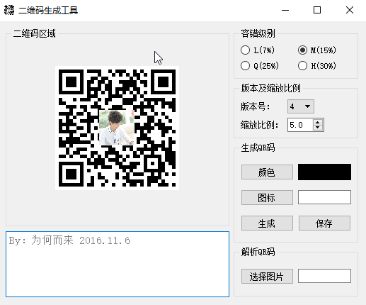
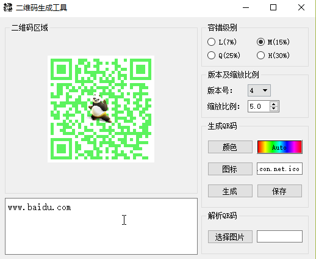
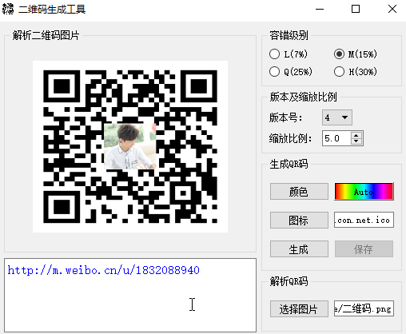

# QRcode
这是一个生成与解析QR二维码的小程序。QR码(日本的一家公司研制的矩阵式二维码符号)也是当前使用最广泛的二维码之一，微信支付宝的扫码都是QR码。  
## 功能概述:
由于QR码有着极其复杂的编码及纠错算法，所以本程序使用的是开源的linux C代码qrencode作为静态库，来生成编码后的01序列，由QT的二维画图QPainter绘制二维码。同时使用基于C++代码应用于QT的QZXing作为动态库，来解码图片，恢复原始信息。  
### 生成编解码库:
* **qrencode编码库生成(开源库地址: http://fukuchi.org/works/qrencode/)**   
将下载的压缩包解压，linux下可以直接执行"./config  make  make install"命令生成库文件。在windows下或者linux下只想要生成编码算法的库，而不需要libpng等图片库则可以按照下面步骤自己编译。  
1)创建一个空的Qt项目，只包含pro文件，将qrencode源码中的(\*.h  \*.c)加入到工程中（不要加qrenc.c,因为这里面使用了png库，本程序用QPainter自己画不需要该库）  
2)将源码中的config.h.in文件修改成config.h并加入工程（因为公司加密原因，这里遇到了问题，但一般情况直接改扩展名即可）  
3)在QT的pro文件中添加DEFINES += HAVE_CONFIG_H 定义全局宏定义  
4)重新定义config.h文件中的MAJOR_VERSION、MICRO_VERSION、MINOR_VERSION、VERSION  
5)修改pro文件，设置”TEMPLATE = lib，CONFIG += staticlib“。(因为使用qt编译c源码还不会生成动态库(.dll + .a/.lib(此处不是静态库，而是动态库的辅助文件，供编译时使用))，所以使用了静态库。)  
6)编译生成静态库libqrencodeLib.a（因为我使用的Qt是基于MinGW的，静态库和linux一样是.a，而windows下的VS则是.lib）  
注：在该仓库的libs/source_code/qrencodeLib/下已经提供了按照上述方法配置好的pro项目，只需通过creator打开直接编译就能生成静态库。  
* **QZXing解码库生成(开源库地址: https://sourceforge.net/projects/qzxing/)**  
1)动态库：QZXing源码默认直接构建能生成动态库，包括QZXing.dll动态库和libQZXing.a辅助文件(针对windwos下的MinGW),或者是libQZXing.so*库(针对linux)。  
2)静态库：修改QZXing.pro文件，添加CONFIG += staticlib，删除DEFINES -= DISABLE_LIBRARY_FEATURES,编译即可生成静态库libQZXing.a。  

注：在该仓库的libs/目录下除了提供了qrencode和QZXing的源码外，也提供了linux和window两平台下编译好的库，可以直接使用。但如果平台架构或者系统位数不同，那么提供的现成的库则可能无法使用。比如仓库里提供的linux平台的库是x86-32bit的ubuntu系统下生成的，在64bit系统下就无法使用，这时就需要按照上述的方式自己编译生成对应平台的库。

### 使用编解码库：
* **使用qrencode库**  
1)在项目pro文件中配置"LIBS += -L路径 -lqrencodeLib"，然后在调用该库接口的地方包含"qrencode.h"头文件。  
2)使用qrencode库中的方法编码只需要调用下面的接口函数：  
  ```
  QRcode *qrcode;
  qrcode = QRcode_encodeString("http://m.weibo.cn/u/1832088940", 2,QR_ECLEVEL_Q, QR_MODE_8, 0);
  ```
  其中QRcode 是一个结构体，在data中按行存储着编码后的01字符串，1：黑块  0：白块    
  ```
  typedef struct {
	int version;         //version of the symbol
	int width;           //width of the symbol
	unsigned char *data; //symbol data
  } QRcode;
  ```
* **使用QZXing库**  
1)在项目pro文件中配置"LIBS += -L路径 -lQZXing",然后在调用该库接口的地方包含
“QZXing.h”和“QZXing_global.h”两个头文件。  
2)如果使用的QZXing是静态库，那么还需要在QZXing.h中添加一个宏定义#define DISABLE_LIBRARY_FEATURES，动态库的话则需要放到运行库的搜索路径下。  
3)使用QZXing库中的方法解码只需调用下面的方法:  
  ```
  QZXing *zxing;
  zxing->decodeImage(image);//该方法返回QString串，标识图片二维码的内容
  ```
  
### 运行截图：
  
  
  
## 本程序代码文件结构：
```
qrcodebox.cpp:绘制二维码的部件
qrcodewidget.cpp:主界面，设置参数，生成保存图片，解析展示二维码图片
qrencode.h:qrencode库函数接口头文件
QZXing.h:QZXing库的接口函数
QZXing_global.h:QZXing作为动态库使用时，确定导入导出功能
```
## 附:Qt程序在windows系统上的打包发布
一个程序完成后，使用Qt生成release版本的可执行exe文件，但是仅有exe可执行文件是无法在别人的机器上运行的。因为QT默认是动态编译的，程序还需要各种各样的动态库文件。  
高版本的qt有一个windows下的部署工具windeployqt.exe，可以用来打包Qt程序。首先将生成的release版本的\*.exe(\*表示你的程序名)文件单独放到一个文件夹中，打开qt的命令行工具，或者将部署工具所在目录添加到系统path变量中，使用cmd命令行进入\*.exe所在文件夹，执行命令windeployqt \*.exe；部署工具会自动将依赖的动态库以及插件放到文件夹下。  
另外不使用部署工具的话也可以直接点击\*.exe根据缺少的库自己添加，就能在本机运行了，但往往还是添不全，在别的机器上仍无法运行。因为还需要plugins下面的一些插件（一般是imageformats文件夹下的各种格式的图片库，和platform下的qwindows.dll），总之缺什么去qt库的bin目录和plugins下找就行。  
## 作者联系方式:
**邮箱:justdoit_mqr@163.com**  
**新浪微博:@为-何-而来**  